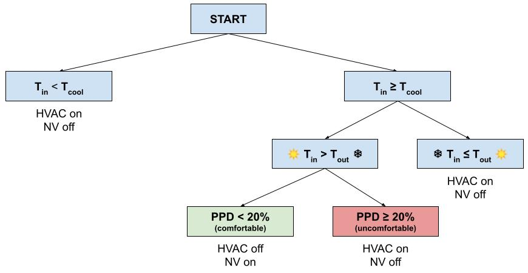
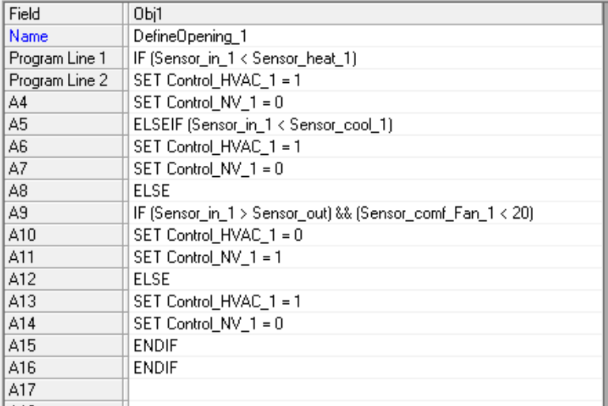

# Documentation on mixed-mode ventilation (MMV) and Airflow Network (AFN)

This document explains the implementation of thermal comfort-driven cooling in BuildME, which was done using mixed-mode ventilation. The procedure can generally be applied to any IDF file, although some limitations exist. The most important ones are listed in the summary below. This document explains also the motivation behind using AirflowNetwork objects in BuildME archetypes. 

Author: Kamila Krych

## Summary
Mixed-mode ventilation (MMV) is a combination of natural ventilation (NV) and mechanical cooling (HVAC). In the MMV setting, the main way to regulate the air temperature in a building is through opening windows, and the HVAC is used only if necessary. This lowers the energy demand for cooling and better reflects the observed real-life energy use, particularly in residential buildings.  

BuildME implements MMV into EnergyPlus simulations using a procedure inspired by Neves et al. (2019). The procedure alters EnergyPlus files, including modification of some (People, IdealLoadsAirSystem) and creation of other objects (e.g., AirflowNetwork and EnergyManagementSystem objects). The conversion is done in two steps: 1) conversion to the AFN variant, where infiltration is modeled using AirflowNetwork objects, and 2) conversion to the MMV variant, where operable windows can be controlled using EnergyManagementSystem objects. The first step can be facilitated using the AFN Converter (found in the `/tools` folder), while the second step is done automatically in the `pre.py` file. All the BuildME archetypes are by default AFN variants, for comparability, i.e., they have been pre-converted. 

The assumptions in the work are:
*	Mechanical cooling is implemented using a simplified HVAC system (_HVACTemplate:Zone:IdealLoadsAirSystem_). If it's not, then one step has to be performed manually (see section 2.7). 
*	Venting through windows is only implemented in zones with the HVAC system, with exactly one People object and at least one vertical window (i.e., not a skylight). The zone is also compatible with AirflowNetwork objects, i.e., it has at least two surfaces (walls, floors, etc.) that are _not_ GroundFCfactorMethod objects, internal partitions, or ceilings. 
* 	Infiltration in the building is only modeled using Airflow Network (AFN) objects. Otherwise, an error would occur and infiltration would not be modeled, thus making it impossible to compare various energy standards (read more in section [Infiltration](#infiltration)).
*	The building has walls aligned with cardinal directions. 
*	The size of the window opening used for venting is 27% of the window area (this assumption can be easily changes, see section 2.6).

## 1. Introduction

### 1.1 Motivation
BuildME uses EnergyPlus software for building energy simulations, and the simulation overestimates cooling energy demand compared to what can be seen in real life. Consequently, the motivation behind this work is to decrease the cooling loads, especially in warmer climates which are specific to many developing countries. This will ensure policy relevance of the BuildME framework, e.g., meeting Sustainable Development Goals. The future buildings should be comfortable, yet the energy demand for cooling should be realistic. BuildME should allow choosing window opening as the default method of cooling, and mechanical air conditioning to only be used when necessary. 

### 1.2 What is mixed-mode ventilation
Mixed-mode ventilation (MMV) is a combination of natural ventilation (NV) and mechanical cooling (HVAC) (Arnold, 1996). The cooling mode is selected depending on factors such as outdoor temperature or thermal comfort level of the occupants. The MMV system allows for reducing energy consumption while still maintaining acceptable thermal conditions. Natural ventilation mode of operation means that the windows are opened for ventilation. The window operation can be controlled manually or automatically (Salcido et al., 2016). If we assume that the window operation is controlled manually—which is generally the case for residential buildings—the MMV system can be viewed as an attempt to model the behaviour of building users. Such a model would assume that the users: (1) keep the HVAC system off when the windows are opened; (2) only use the HVAC cooling if it is not possible to reach satisfactory thermal comfort using natural ventilation, i.e., the HVAC is used as a last resort. 

### 1.3 The purpose of this document
This document describes the development of a procedure to implement MMV into EnergyPlus input files (from now on called ‘the MMV procedure’), and to integrate the MMV simulations into the BuildME framework. 
Section 2 explains the procedure of modifying an EnergyPlus file to include mixed-mode ventilation. Section 3 describes how the MMV procedure has been automated using Python and subsequently incorporated in the BuildME framework. Please note that the MMV procedure has some limitations, the most important ones are listed in Section 2.7.

## 2	EnergyPlus implementation
### 2.1	Background
Neves et al. (2019) has implemented a mixed-mode ventilation system into EnergyPlus simulations of Brazilian office buildings. The source code and underlying EnergyPlus input files were published as open source (Santesso, 2018). The authors implemented MMV using the ideal loads air system (ILAS), airflow network (AFN), and energy management system (EMS). The cooling regime (opening windows vs. air conditioning) was chosen depending on office occupancy, thermal satisfaction of the occupants, and indoor and outdoor temperature.

ILAS objects allow to model a simplified version of the HVAC system, which is easy to understand and handle. AFN objects allow for simulating multizone airflows, also driven by wind. Using AFN, we can define window opening areas that can be used for venting. EMS objects allow to access a wide variety of sensor data and use this data to direct various types of control actions (“actuators”). For the MMV procedure, we can use sensor data on thermal comfort and indoor and outdoor temperatures to decide whether to vent (open windows) or not. The decision tree can be implemented using EnergyPlus runtime language code in the EMS “Program” objects.

The principles used by Neves et al. (2019) can serve as an inspiration but cannot be directly used for BuildME archetypes. Several adjustments are needed: 
1.	Thermal comfort model. Neves et al. (2019) used the ASHRAE 55 adaptive comfort model, which can be used only for a limited range of monthly mean outdoor air temperatures. 
2.	Decision tree. In the one used by Neves et al. (2019), the windows are being opened whenever people are satisfied with the thermal conditions and the outdoor temperature is lower than the indoor operative temperature. Using the same decision tree for heating-dominated climates would increase the need for heating, as windows would be frequently opened even during cold days.  
3.	Infiltration. The MMV modelling in EnergyPlus requires the use of AFN objects, which implies that infiltration must also be modelled using these objects (non-AFN infiltration objects are not simulated if AFN objects are used). 
4.	Wind pressure coefficients. Neves et al. (2019) used a simple rectangular shape to simulate a zone within an office building, and the wind pressure coefficients (WPCs) could be calculated automatically (for definition of WPCs see Section 2.5). For a non-rectangular building—for example with a non-flat roof like the single-family house archetype in BuildME—the WPC curves need to be provided manually. 

The next subsections describe in detail how the updated MMV procedure was implemented in EnergyPlus. 

### 2.2	Thermal comfort model
Thermal comfort model is required in the MMV procedure to ensure that  building occupants are satisfied with the thermal conditions in the building when the HVAC system is off. The model developed by Neves et al. (2019) used ASHRAE 55 adaptive comfort model, which is only applicable in particular cases. As the EnergyPlus documentation explains: _"If the monthly mean outdoor air temperature is not within the specified domain of 10.0 to 33.5C, the model is not applicable."_ (U.S. Department of Energy, 2019a, p. 1498). If we want the method to be versatile, the thermal comfort model needs to be changed. 

An alternative to ASHRAE 55 adaptive comfort model is the Fanger model, which does not include adaptive properties, which makes people adjust their thermal comfort requirements depending on the outdoor temperature. This makes the Fanger model relatively simpler, and makes it work for all outdoor temperature ranges.

In order to use the Fanger model, all the EnergyPlus objects People need to contain Fanger in the field _Thermal Comfort Model 1 Type_. Additionally, an EMS sensor needs to be created for each _People object—Output:Variable_ field needs to contain the name of the _People_ object and the name of the variable we want to check for, in this case _Zone Thermal Comfort Fanger Model PPD_.

### 2.3	Decision tree
The decision to open the windows or use the HVAC system depends on several conditions. The decision tree implemented in BuildME can be seen in Figure 1. The first-level decision depends on the indoor temperature in relation to the heating and cooling setpoints. The windows are opened if three conditions are met simultaneously: (1) the indoor temperature is above the cooling setpoint, (2) the indoor operative temperature is higher than the outdoor, (3) less than 20% of the people are dissatisfied with the thermal conditions. The last condition uses the Fanger comfort model to determine the percentage of people dissatisfied (PPD). The implementation of the decision tree in EnergyPlus can be seen in Figure 2.

**Figure 1**: The decision tree used in this work to control the HVAC and natural ventilation (NV) systems. $T_{in}$ is the indoor operative temperature, $T_{out}$ is the outdoor temperature, $T_{cool}$ is the cooling setpoint, and $PPD$ is the percentage people dissatisfied.
 

**Figure 2**: Energy management system program with the decision tree, shown in the IDF Editor.

### 2.4 Infiltration
The infiltration modelling is key for achieving the full functionality of BuildME, as the framework uses various infiltration levels to reflect various energy standards. However, for MMV-based cooling types, the archetype must model the infiltration using AFN objects as well. Otherwise, the EnergyPlus simulation yields the following error:

`** Warning ** GetAirflowNetworkInput:AirflowNetwork:SimulationControl object, Specified AirflowNetwork Control = "MultizoneWithoutDistribution" and ZoneInfiltration:* objects are present. ZoneInfiltration objects will not be simulated. `

This means that—once the AFN objects are used within the model—the only way to model infiltration is by using AFN objects as well. For comparability reasons between HVAC-only and MMV cooling types, AFN infiltration is implemented in all cooling types. 

The MMV procedure models infiltration using the same approach as in the DesignBuilder software (2009, pp. 209–210, 414–415), which in turn is based on empirical data presented by Orme et al. (1998). DesignBuilder models airtightness/infiltration standards using airflow network objects. Each surface with cracks allowing for air flow has its own _AirflowNetwork:MultiZone:Surface_ object. In the field_ Leakage Component Name_, one specifies a name of either Crack or DetailedOpening object. Crack objects serve for surface types such as walls, floors, roofs etc. while DetailedOpening objects serve for doors and windows. 

Both Crack and DetailedOpening objects include fields called _Air Mass Flow Coefficient_ and _Air Mass Flow Exponent_. Depending on the airtightness standard and surface type, DesignBuilder uses different values for coefficients and exponents, as specified in the so-called crack templates. BuildME energy standards were mapped to DesignBuilder airtightness standards as seen in Table 1. 

**Table 1**: The mapping of BuildME energy standards to DesignBuilder airtightness standards.

|     BuildME energy standard    |     Design Builder airtightness standard     |
|--------------------------------|----------------------------------------------|
|     ZEB                        |     Excellent                                |
|     Efficient                  |     Good		                        |
|     Standard                   |     Medium                                   |
|     Non-standard               |     Poor                                     |

Please note that the two object types _AirflowNetwork:MultiZone:Surface:Crack_ and _AirflowNetwork:MultiZone:Component:DetailedOpening_ have different units for the air mass flow coefficient—kg/s and kg/s.m, respectively—and that the values for Crack objects are **not normalized**. Consequently, the coefficients used in the Crack objects need to be multiplied by the surface area. This is done automatically in the method `write_to_excel_replace` in `mmv.py`, as further explained in Section 3.3. The normalized coefficient and exponent values for all energy standards and all surface types can be found in “mmv-implementation.xlsx” file in sheet AFN. 

### 2.5	Wind pressure coefficients
Wind pressure coefficients (WPCs) are coefficients used in Bernoulli’s equation which is used for airflow calculations (U.S. Department of Energy, 2019a, p. 611). The coefficient values are dependent on the building envelope and wind direction. This dependency can be observed in Figure 3, which shows WPC curves for a high-rise building with high wind shielding. For every wind direction and every wall orientation, the WPC value is different. The only curve independent on wind direction is the one for the flat roof.
 

**Figure 3**: Wind pressure coefficient curves for a high-rise building with high wind shielding.

The WPC curves can be calculated automatically if the field Wind Pressure Coefficient Type in the object _AirflowNetwork:SimulationControl_ is set to _SurfaceAverageCalculation_. However, EnergyPlus Input Output Reference specifies that this option can only be used for rectangular buildings (U.S. Department of Energy, 2019b, p. 1055). For other building shapes, _Wind Pressure Coefficient Type_ has to be set to _Input_, and the WPC curves need to be defined manually. This is necessary for the MMV procedure, as some archetypes are not rectangular, e.g., the SFH archetype has a pitched roof. 

The WPC curves are defined using _AirflowNetwork:MultiZone:WindPressureCoefficientArray_ and _AirflowNetwork:MultiZone:WindPressureCoefficientValues_, where the former specifies the wind direction values, and the latter specifies the coefficient values for the given wind directions. The WPC arrays can be defined for multiple surfaces, such as the different surface types and orientations seen in Figure 3. WPC curves for walls exhibit the same pattern, just with a different offset. 

The values for WPCs were obtained separately for low-rise (Orme et al., 1998, pp. 82–84) and high-rise buildings (Integrated Environmental Solutions, 2018). The low-rise buildings are up to 3 storeys high. The values are available for three levels of wind shielding—low, medium, and high—which reflect the height of buildings surrounding the building being modelled. The WPC arrays and values used in the MMV procedure are listed in method `retrieve_WPC_values` in `mmv.py` file. 

The determination of exact wind pressure coefficients requires empirical data: _“Wind pressure coefficients may be obtained by a variety of means, including in situ measurements, CFD studies and wind tunnel experiments.”_ (Integrated Environmental Solutions, 2018). The values used in the MMV procedure are therefore only indications of the real values, and they come with numerous assumptions:
* Length-to-width ratio of all the buildings is 1:1. 
* The high-rise archetypes have a flat roof.
* The low-rise archetypes have a pitched roof with over 30 degrees pitch.
* The coefficients for the high-rise archetypes are given at the ground level (elevation at h/H=0, where h is the height of the opening and H is the height of the building). 

The assumptions above come from low data availability and intentional simplification of the model. 

After the WPC curves are defined in EnergyPlus using _AirflowNetwork:MultiZone:WindPressureCoefficientArray_ and _AirflowNetwork:MultiZone:WindPressureCoefficientValues_ objects, they need to be matched with external node objects (more about external nodes in Section 2.6). As every node is specific to one surface, the orientation of that surface will determine the WPC curve it is assigned to. The orientation of the surface (i.e., its azimuth) can be easily checked using eppy (see Section 3). The resulting value in degrees can then be matched with WPC curves for cardinal directions, knowing that: _“The Azimuth Angle indicates the direction that the wall faces (outward normal). The angle is specified in degrees where East = 90, South = 180, West = 270, North = 0.”_ (U.S. Department of Energy, 2019b, p. 257). This procedure can be found in the method assign_wpc_curve in mmv.py. 

### 2.6	List of all created/modified objects
This section describes all the objects which need to be either created or modified for the MMV procedure.  Unless specified otherwise, the default field values were used. 

**Schedule:Constant**

For each zone with the HVAC system (see HVACTemplate:Zone:IdealLoadsAirSystem below), two schedules should be created to control the HVAC and natural ventilation mode in that zone. The schedules can be called for example  _HVAC_Sch_1_ and _NV_Sch_1_, respectively. 

**People**

For each existing People object, the field _Thermal Comfort Model 1_ Type should be set to _Fanger_. 

**HVACTemplate:Zone:IdealLoadsAirSystem**

For each zone with the HVAC system, the value of the field System Availability should be set to the name of schedule created specifically to control the HVAC mode in that zone, e.g., _HVAC_Sch_1_. Two constant schedules should also be created, i.e., _always_on_BuildME_ and _always_off_BuildME_.

**AirflowNetwork:SimulationControl**

The object fields which are not set to their default values include: 
*	Airflow Network Control. The value is set to _MultizoneWithoutDistribution_, which was also used by Neves et al. (2019). 
*	Wind Pressure Coefficient Type. Described in Section 2.5. 
*	Height Selection for Local Wind Pressure Calculation. The value is set to OpeningHeight, which simplifies the input of ExternalNode objects, i.e., the height of each node can be set to 0, as the opening height can be calculated automatically. The only drawback for this option is that the number of external nodes needs to be equal to the number of external surfaces modelled in AFN (see “AirflowNetwork:MultiZone:ExternalNode” below).

**AirflowNetwork:MultiZone:Zone**

There should be one object of type _AirflowNetwork:MultiZone:Zone_ for each zone in the building. The object fields which are not set to their default values include: 
*	Ventilation Control Mode. The value is set to Constant, as the venting will be controlled by the schedule specified in the field described below.
*	Venting Availability Schedule Name. For all zones, the value is set to _always_on_BuildME_.

**AirflowNetwork:MultiZone:Surface**

This object should be created for every surface with cracks allowing for infiltration (walls, roof, floors etc.) and every surface with opening (doors and windows). Even if two walls have the same area and the same orientation, but belong to different zones, they must have distinct AirflowNetwork:MultiZone:Surface objects. 

The object fields which are not set to their default values include: 
* Leakage Component Name. Described in Section 2.4.
* External Node Name. For external surfaces, this field value should be the same as the name of external node created specifically to define outdoor environmental conditions for the surface, e.g., _Node_1_. For internal surfaces, this field is left blank.
* Window/Door Opening Factor. 
  * For operable windows, set to 0.27. This means that when these windows are open, 27% of the window area is used for ventilation. This is the value used by Neves et al. (2019), verified empirically for the office buildings in Brazil. This value likely changes depending on the building type, region etc., but in the absence of more accurate data, the factor of 27% was kept for the MMV procedure. 
  * For all the other objects (walls, non-operable windows, doors, etc.), set to 1. 
* Ventilation Control Mode. The value is set to _Constant_, as the venting will be controlled by the schedule specified in the field described below.
* Venting Availability Schedule Name:
    * For windows which are not operable (they are always closed) and for doors, this field value is set to _always_off_MMV_ (a schedule which is always set to 0).
    * For operable windows, this field is set to _NV_Sch_1_, where the schedule number corresponds to the zone that the window belongs to.
    * For surfaces other than windows or doors, the value of this field should be set to _always_on_MMV_ (a schedule which is always set to 1). 
    
**AirflowNetwork:MultiZone:Surface:Crack**

This object should be created for every non-fenestration surface type (external wall, internal wall etc.) and every surface area. This object contains fields Air Mass Flow Coefficient and Air Mass Flow Exponent (for details, see Section 2.4). These values differ depending on the surface type and the energy standard we want to simulate. Surfaces having the same area can use the same Crack object, as the air mass flow coefficient is calculated based on the surface area. 

**AirflowNetwork:MultiZone:Component:DetailedOpening**

This object should be created for every fenestration surface type (external window, internal window, external door, internal door). As opposed to Crack objects, surfaces of different surface areas can be grouped together as long as they belong to the same surface type. This is because the air mass flow coefficient is normalized (not dependent on the surface area of the fenestration object). 
The object fields which are not set to their default values include: 
*	Air Mass Flow _Coefficient_ When Opening is Closed. Described in Section 2.4. The values differ depending on the surface type and the energy standard we want to simulate.
*	Air Mass Flow _Exponent_ When Opening is Closed. Described in Section 2.4. The values differ depending on the surface type and the energy standard we want to simulate.
*	Number of Sets of Opening Factor Data. The value is set to 2. This means that we specify the values for two sets: when the opening is closed (Set 1) and opened (Set 2). 
*	Opening Factor 1. The value is set to 0, i.e., closed opening. 
*	Discharge Coefficient for Opening Factor 1. The value is set to 0.6, based on the work by Neves et al. (2019): _“[t]he discharge coefficient (Cd) was set as 0.6, which corresponds to the discharge coefficient of a standard circular sharp-edged orifice”_.
*	Width Factor for Opening Factor 1. Set to 0; for a closed opening the width of the opening should be 0% of the window width. 
*	Height Factor for Opening Factor 1. Set to 0; for a closed opening the heigh of the opening should be 0% of the window height.
*	Start Height Factor for Opening Factor 1. Set to 0; the opening can start at the bottom of the fenestration surface.
*	Opening Factor 2. The value is set to 0, i.e., opened opening.
*	Discharge Coefficient for Opening Factor 2. The value is set to 0.6, based on the work by Neves et al. (2019): _“[t]he discharge coefficient (Cd) was set as 0.6, which corresponds to the discharge coefficient of a standard circular sharp-edged orifice”_.
*	Width Factor for Opening Factor 2. Set to 1; for an opened opening the width of the opening should be 100% of the window width. 
*	Height Factor for Opening Factor 2. Set to 1; for an opened opening the width of the opening should be 100% of the window height. Together with the window width defined above, this specifies the maximum opening; however, when windows are opened for venting, only 27% of the window area is used, according to the _Window/Door Opening Factor_ field in AirflowNetwork:MultiZone:Surface objects. 
*	Start Height Factor for Opening Factor 2. Set to 0; the opening can start at the bottom of the fenestration surface.

**AirflowNetwork:MultiZone:ExternalNode**

There should be one external node for each external surface defined in _AirflowNetwork:MultiZone:Surface_. If this condition is not satisfied, an error message appears: 

`** Severe  ** GetAirflowNetworkInput: When the choice of Height Selection for Local Wind Speed Calculation is OpeningHeight, the number of external surfaces defined in AirflowNetwork:MultiZone:Surface objects has to be equal to the number of AirflowNetwork:MultiZone:ExternalNode objects.`

This is a consequence of the modelling choices selected in the AirflowNetwork:SimulationControl object. However, this choice simplifies the set up of external nodes, as External Node Height field can be left with default 0—the node height is calculated automatically, based on the surface it is matched with. 
The object fields which are not set to their default values include just Wind Pressure Coefficient Curve Name, which should be set to the WPC curve name which corresponds to the azimuth of the surface that this node belongs to (also explained in Section 2.5). 

**AirflowNetwork:MultiZone:WindPressureCoefficientArray**

Described in Section 2.5.

**AirflowNetwork:MultiZone:WindPressureCoefficientValues**

Described in Section 2.5.

**EnergyManagementSystem:Sensor**

Sensors monitor the conditions of the chosen variables in the building simulation. There are multiple objects of this type that should be created. For each of them, we need to specify (1) Output Variable Type and (2) Output Variable Name:
1.	Outdoor temperature sensor (Sensor_out). Variable type: _Environment_; Variable name: _Site Outdoor Air Drybulb Temperature_.
1.	Cooling setpoint sensor (Sensor_cool_X). Variable type: the name of the cooling schedule used in the zone's thermostat; Variable name: _Schedule Value_.
1.	Operative indoor temperature sensor (Sensor_in_X). Variable type: zone's name; Variable name: _Zone Operative Temperature_.
1.	Thermal comfort sensor (Sensor_comf_Fan_X). Variable type: zone's people object (we assume there is one per zone); Variable name: _Zone Thermal Comfort Fanger Model PPD_.

Please note that 'X' in the sensor name denotes that this object is created as many times as there are HVAC-type zones.

**EnergyManagementSystem:Actuator**
Actuators control the values of the chosen variables in the building simulation. There are multiple objects of this type that should be created. For each of them, we need to specify (1) Actuated Component Unique Name, (2) Actuated Component Type, and (3) Actuated Component Control Type:
1.	HVAC schedule control (Control_HVAC_X). Component name: schedule name of the form HVAC_Sch_X; Component type: _Schedule:Constant_; Component control type: _Schedule Value_. This object should be created for each zone with the MMV system.
2.	Natural ventilation schedule control (Control_NV_X). Component name: schedule name of the form HVAC_Sch_X; Component type: _Schedule:Constant_; Component control type: _Schedule Value_. This object should be created for each zone with the MMV system.

**EnergyManagementSystem:ProgramCallingManager**

This object should be created for each zone with the MMV system. For each of these objects, we have the following fields:
*	EnergyPlus Model Calling Point. The value is set to _BeginTimestepBeforePredictor_.
*	Program Name 1. This field value should be the same as the name of the EMS program created specifically to control the MMV system in a given zone, e.g., _DefineOpening_1_.

**EnergyManagementSystem:Program**

This object should be created for each zone with the MMV system. The decision tree used in the program was described in Section 2.3. Depending on the conditions detected by sensors specific for a given zone, the HVAC and natural ventilation system is turned on or off (controlled by schedule values).

### 2.7	Implementing the MMV procedure manually
As explained above, the mechanical cooling should be implemented using a simplfied HVAC system (_HVACTemplate:Zone:IdealLoadsAirSystem_ or  _ZoneHVAC:IdealLoadsAirSystem_). Implementation of MMV for buildings with more complex HVAC systems cannot be easily automated but can be done manually. This requires an important step: finding an HVAC object which can be used to control the HVAC system of independent zones using a schedule. 

In case of the IdealLoads HVAC system, this role is played by object _HVACTemplate:Zone:IdealLoadsAirSystem_ and object field _System_Availability_Schedule_Name_ (see Figure 4). For other HVAC system types, such an object has to be manually found. Many of the HVAC-related objects have a schedule associated with it. Just try to set the schedule to 0 (by assigning it a constant `Schedule` object) and see if this allows to turn off the mechanical cooling. The ultimate goal is to find a variable that can control the HVAC system in a given zone, i.e. turning it on or off. Additionally, the object name should be zone-specific, just like the one in IdealLoadsAirSystem (see Figure 4). 

**Figure 4**: HVACTemplate:Zone:IdealLoadsAirSystem object, shown in the IDF Editor. Please note that the object name is the same as the zone name and that the _System Availability Schedule Name_ is set to "always available".

Once such an object is found, we need to modify the mmv-implementation.xlsx file. In the _change_ sheet, we modify the last row to include the HVAC object name and the object field. The _name_ and _value_ columns should be left intact.

## 3	Python implementation
BuildME implements the MMV procedure automatically, using a Python script, which creates new EnergyPlus objects and modifies others. The implementation is based on eppy: a scripting language for EnergyPlus input files, written in Python (Santosh, 2021). The code can be found in the `mmv.py` file. The MMV cooling setting can be chosen as one of the simulation combinations - the cooling type can be set to _HVAC_ or _MMV_. The HVAC option uses only the HVAC system to satisfy the cooling needs of the building; the MMV option uses a combination of HVAC and natural ventilation. 

Whenever the MMV option is selected during the execution of BuildME, the method `mmv.change_archetype_to_MMV` is activated. 

The `change_archetype_to_MMV` method includes (1) creation of dictionaries; (2) modification of the idf file.

The “mmv-implementation.xlsx” file contains information necessary to perform operations in `mmv.py`; it contains five sheets: 
* _change_ with data used for modifying EnergyPlus objects; 
* _create-AFN_ with data used for creating new EnergyPlus objects required to convert an idf file to one with infiltration modeled as AirflowNetwork objects;
* _create-MMV_ with data used for creating new EnergyPlus objects required to convert an idf file to one with the MMV system; 
* _delete_ with data used for deleting unnecessary EnergyPlus objects; 
* _AFN_ with data for infiltration modelling; 
* _EMS program_ with data for the EnergyManagementSystem:Program object.

### 3.1	Creation of dictionaries
Dictionaries are created in the method `create_dictionaries` and they are used to handle the building entities of a given type. For the MMV procedure, many EnergyPlus objects need to be created for every zone, or for every surface of a given type. As every building archetype is different, the creation of a new EnergyPlus object is placed in a while loop, which is exited only when all the entries in a given dictionary have been iterated through (see Section 3.2 for more). 

Several dictionaries are created in this method:
1. `surface_dict` A dictionary with surface information (walls, floors, windows etc.), with integer keys. Includes only surfaces for which AFN objects can be implemented, i.e. surfaces excluding GroundFCfactorMethod objects, internal partitions, and ceilings (but floors and roofs are included). Required for creating objects _AirflowNetwork:MultiZone:Surface_ and corresponding nodes. 
1. `zone_dict_mmv` A dictionary of zones suitable for MMV (their names and the people object that belongs to it). Required for multiple objects in the MMV procedure, e.g., the schedule numbers _HVAC_Sch_X_ and _NV_Sch_X_.
1. `zone_dict_non_mmv` A dictionary of zones not suitable for MMV but suitable for AFN objects. This happens when a zone does not have an associated HVAC system, people object or vertical external windows. In such zones, AFN objects will be created, but windows belonging to these zones are not going to be operable. 
1. `zone_dict_non_afn` A dictionary of zones not suitable for AFN objects. Surfaces that belong to these zones are not part of `surface_dict` either. 
1. `surfaces_f_dict` A dictionary of fenestration objects (windows, doors) for which AFN `Opening` objects will be created. 
1. `surfaces_nf_dict` A dictionary of non-fenestration objects (walls, floors, etc.) for which AFN `Crack` objects will be created.

### 3.2	Modification of the idf file
Once the required dictionaries are created, the idf file can be modified. This is done in two steps: 1) conversion to the "AFN variant", 2) conversion to the "MMV variant". 

The AFN variant is an archetype variant with infiltration modeled as AirflowNetwork objects. **All the BuildME archetypes are AFN variants by default.** This is because the HVAC and the MMV cooling settings should have the same infiltration levels in order to be comparable. The AFN variant is created by: creating wind pressure coefficient (WPC) curves, and changing/deleting/creating chosen objects. The objects created in this step are those related to AFN objects and schedules. The conversion to the AFN variant is done by the `change_archetype_to_AFN` function, and is facilitated using the AFN Converter, found in the `/tools/` folder. 

The MMV variant is an archetype variant combining mechanical (HVAC) and natural (NV) cooling. BuildME converts the AFN variant (default) into the MMV variant every time a BuildME simulation is performed with `MMV` chosen as the cooling setting. The conversion is done by the method `change_archetype_to_MMV`, initiated automatically in `pre.py`. The MMV variant is created by adding extra objects related to the energy management system (EMS).

### 3.3	Updating the “replace-mmv.xlsx” file
After the idf file has been updated to include the MMV procedure, the last step is to write down the information needed to simulate different energy standards of the archetype. As some of this data is archetype-specific, it needs to be stored in a file. We use “replace-mmv.xlsx” file for this purpose.

If this is the first archetype converted to the MMV variant, the “replace-mmv.xlsx” file needs to be created; otherwise, it can just be modified. This is done using the function `create_or_update_excel_replace`. After a worksheet has been created or opened, a function `write_to_excel_replace` fills the xlsx file with the parameters for DetailedOpening and Crack objects. The two objects are treated slightly differently. For DetailedOpening objects, the algorithm feeds the values directly from “mmv-implementation.xlsx” into “replace-mmv.xlsx”. For Crack objects, only Air Mass Flow Exponent is taken directly from one xlsx file to the other, while Air Mass Flow Coefficient values are first multiplied by the area of the surface that the given Crack object refers to. This is also why the creation of the Crack objects requires the use of the `create_surface_group_dicts` dictionary, which groups surfaces from the same surface group (e.g., external walls) and of similar area. 

## 4	Possible future work
The implementation of the MMV procedure into EnergyPlus and Python could still be improved. Some possible areas of improvement include:
*	Add internal resistance for airflow. This model probably overestimates the extent to which the air in the living units can be exchanged through the use of the window venting, as the internal walls and other physical obstructions to airflow are not included in the archetypes. However, this is not straightforward, because it would probably require adding additional zones (in EnergyPlus, internal walls are generally used to separate zones). 
*	Change the window opening factor. Right now, it is assumed that the share of window that is opened for venting is 27% of window area, which is a number taken from Neves et al. (2019), who obtained this number for Brazilian office buildings. In case of other building types in other world regions, the window opening factor is probably different, but there is no data on this topic. The window opening factor could also be modelled as a function of the occupancy of the building. 
*	Add more specific WPC curves. The WPC curves used in this work were taken from literature and are not specific to the building archetypes use in BuildME. One of the sources used for WPC data even warned: _“The values presented in this section must only be regarded as approximate and therefore, if more accurate design information is required, recourse to specific wind tunnel or full scale measurements will have to be considered. The intention of these data sets is to provide the user with an indication of the range of pressure coefficient values which might be anticipated for various building orientations and for various degrees of shielding.”_ (Orme et al., 1998, p. 44).

## 5	References
* Arnold, D. (1996, February 17). Mixed-mode HVAC -- An alternative philosophy. ASHRAE Transactions: Symposia, Article CONF-960254-. Winter meeting of American Society of Heating, Refrigeration and Air Conditioning Engineers, Atlanta, GA (United States). https://www.osti.gov/biblio/392497-mixed-mode-hvac-alternative-philosophy
* Integrated Environmental Solutions. (2018). Wind Pressure. https://help.iesve.com/ve2018/wind_pressure.htm?ms=QQAAAAAEAAAAAAAAAAAAAAAAAAAAAAAAAAAAAAAAQAQQ&st=MA%3D%3D&sct=MzM3LjA4MzMxMjk4ODI4MTI1&mw=MjQw
* Neves, L. O., Melo, A. P., & Rodrigues, L. L. (2019). Energy performance of mixed-mode office buildings: Assessing typical construction design practices. Journal of Cleaner Production, 234, 451–466. https://doi.org/10.1016/j.jclepro.2019.06.216
* Orme, M., Liddament, M. W., & Wilson, A. (1998). Numerical Data for Air Infiltration and Natural Ventilation Calculations. The Air Infiltration and Ventilation Centre.
* Salcido, J. C., Raheem, A. A., & Issa, Raja. R. A. (2016). From simulation to monitoring: Evaluating the potential of mixed-mode ventilation (MMV) systems for integrating natural ventilation in office buildings through a comprehensive literature review. Energy and Buildings, 127, 1008–1018. https://doi.org/10.1016/j.enbuild.2016.06.054
* Santesso, C. A. (2018). ParIDF: Python open source code developed to perform parametric simulations through EnergyPlus Building Energy Simulation (BES) software (Source code). Universidade de São Paulo. https://www.iau.usp.br/laboratorios/lca/index.php/trabalhos-conforto/
* Santosh, P. (2021). eppy: Scripting language for E+ idf files, and E+ output files (Version 0.5.56) [Python; OS Independent]. https://github.com/santoshphilip/eppy
* U.S. Department of Energy. (2019a). EnergyPlus Version 9.2.0 Documentation: Engineering Reference.
* U.S. Department of Energy. (2019b). EnergyPlus Version 9.2.0 Documentation: Input Output Reference.
