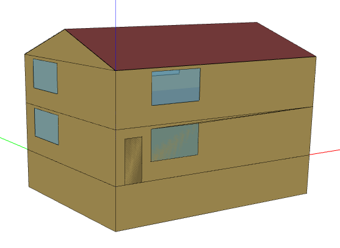

# Procedures of BuildME

## Energy model

Energy demand is calculated by energyplus.

### Manipulation of energyplus files

That means much of the scenarios are applied by means of manipulation of the energyplus files.

#### Energy standard

The current model knows four energy standards, which may differ per region: 'non-standard', 'standard', 'efficient', and 'ZEB'. In order to change the energy standard of a given IDF archetype, the  'Constructions' (and with it the 'Materials') are replaced in the file. The following component-subtypes exist: `ext-wall-non-standard`, `ext-wall-standard`, `ext-wall-efficient`, `ext-wall-ZEB`. Same for the other components, such as roof, windows, etc.

The base archetype (e.g. `./data/archetype/USA/SFH.idf`) contains the `standard` variant of each element, which must be replaced by `apply_energy_standard()` before the copy process.

The energy standards are defined as follows:

- **non-standard**: Values ca. 30% above IECC 2006 are used
- **standard**: IECC 2006 is used
- **efficient**: IECC 2012 is used
- **ZEB**: Current best practice values

