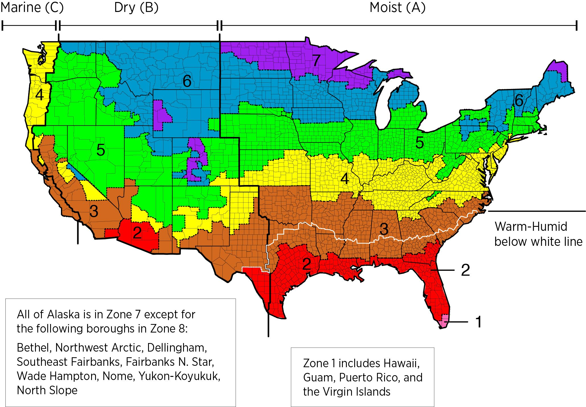

# Climate data

- https://www.energy.gov/sites/prod/files/2015/10/f27/ba_climate_region_guide_7.3.pdf

| Climate zone | Description      | $HDD_{18°C}$      | $CDD_{10°C}$      | Representative city          |
| :----------- | ---------------- | ----------------- | ----------------- | ---------------------------- |
| 0            | Extremely hot    | n/a               | 6000 < CDD        |                              |
| 1A           | Very Hot – Humid | n/a               | 5000 < CDD        | Miami, Florida               |
| 1B           | Very Hot – Dry   | n/a               | 5000 < CDD        | *Apparently not found in US* |
| 2A           | Hot – Humid      | n/a               | 3500 < CDD ≤ 5000 | Houston, Texas               |
| 2B           | Hot – Dry        | n/a               | 3500 < CDD ≤ 5000 | Phoenix, Arizona             |
| 3A           | Warm – Humid     | n/a               | 2500 < CDD ≤ 3500 | Atlanta, Georgia             |
| 3B-Coast     | Warm – Dry       | n/a               | 2500 < CDD ≤ 3500 | Los Angeles, California      |
| 3B           | Warm – Dry       | n/a               | 2500 < CDD ≤ 3500 | Las Vegas, Nevada            |
| 3C           | Warm – Marine    | HDD ≤ 2000        | CDD ≤ 2500        | San Francisco, California    |
| 4A           | Mixed – Humid    | 2000 < HDD ≤ 3000 | 2500 ≤ CDD        | Baltimore, Maryland          |
| 4B           | Mixed – Dry      | 2000 < HDD ≤ 3000 | 2500 ≤ CDD        | Albuquerque, New Mexico      |
| 4C           | Mixed – Marine   | 2000 < HDD ≤ 3000 | n/a               | Seattle, Washington          |
| 5A           | Cool – Humid     | 3000 < HDD ≤ 4000 | n/a               | Chicago, Illinois            |
| 5B           | Cool – Dry       | 3000 < HDD ≤ 4000 | n/a               | Boulder, Colorado            |
| 6A           | Cold – Humid     | 4000 < HDD ≤ 5000 | n/a               | Minneapolis, Minnesota       |
| 6B           | Cold – Dry       | 4000 < HDD ≤ 5000 | n/a               | Helena, Montana              |
| 7            | Very cold        | 5000 < HDD ≤ 7000 | n/a               | Duluth, Minnesota            |
| 8            | Subarctic        | 7000 < HDD        | n/a               | Fairbanks, Alaska            |

- According to [this document](https://www.energy.gov/sites/prod/files/2015/10/f27/ba_climate_region_guide_7.3.pdf) it seems like IECC climate zones are based on ASHRAE 90.1 climate zones.
- 1–8 describes the temperature
- A–C describes moisture regimes
- Representative cities: https://www.energy.gov/eere/buildings/commercial-reference-buildings
- HDD/CDD info: https://codes.iccsafe.org/content/IgCC2015/normative-appendix-a-climate-zones-and-prescriptive-building-envelope-and-duct-insulation-tables?site_type=public
- No of houses per climate region: https://www.eia.gov/consumption/residential/data/2015/hc/php/hc2.6.php